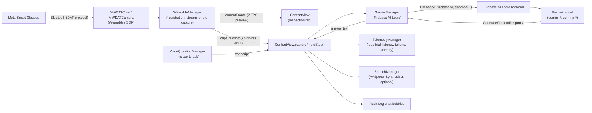

# Smart Eyes MVP — Technical Documentation

Bachelor thesis: *Smart Eyes — Building an AI visual assistant for real-world technical inspections.*
Xcode project: `SmartEyesMVP.xcodeproj` → app target `SmartEyesMVP`, bundle ID `ch.glisic.SmartEyesMVP`.

> **How to read this document.** `../SmartEyesV1-research` is the base application — it is a complete, independently replicable project, and its own `DOCUMENTATION.md` is the authoritative reference for the DAT SDK integration, the Firebase AI Logic call path, telemetry, and every piece of setup the two apps share. This document assumes you have **already built and run the research-track app successfully** and describes **only what is different in the MVP**. Sections below are marked **(unchanged from the base app)** where the MVP reuses that implementation as-is, and **(new in MVP)** / **(changed)** where it doesn't.

> **This is a sanitized handoff copy.** All developer-specific credentials have been removed or replaced with placeholders. See [`SETUP.md`](./SETUP.md) for exactly what to supply before this project will build.

---

## 1. Overview

Smart Eyes MVP is the current, client-facing build. It builds directly on the sibling research/testing-track application (`../SmartEyesV1-research`), which validated the Meta Wearables Device Access Toolkit (DAT) → iOS → Gemini pipeline end to end. The MVP keeps that core pipeline (glasses → `WearableManager` → frame buffer → vision model → chat UI) and restructures it around real inspection tasks rather than test phases, adding:

1. **Hands-free voice interaction** — a dedicated `VoiceQuestionManager` lets the technician dictate their question instead of typing it, via explicit tap-to-start/tap-to-stop dictation. Unlike the base app, this build ships **no wake-word listener at all** — see Section 9.
2. **Server-managed API keys via Firebase AI Logic** — the app never asks the user for a raw Gemini API key; `GeminiManager` talks to Gemini through `FirebaseAILogic`, with the key held by the linked Firebase project. (The base app now shares this property too, as of the current handoff copy — see Section 9.)

The app presents three tabs: **Setup** (device connection, feed control, mock/live toggle, voice output, model selection), **Inspection** (live camera preview + "Take Photo"), and **Audit Log** (chat history with the vision model, voice/text question composer, telemetry export). The user picks a **use case** (a named system prompt — Pipe Analysis, Gauge Reading, Anomaly Detection, or Workplace Safety/SUVA), captures one photo, and can ask several follow-up questions about it in a single multi-turn conversation before capturing the next photo.

---

## 2. Prerequisites

Same hardware/toolchain class as the base app **(unchanged)**, plus this project's own Firebase app registration:

- **Hardware**: Meta smart glasses (exact model — `[VERIFY]`, not recorded in any project file), an iPhone capable of running iOS with `IPHONEOS_DEPLOYMENT_TARGET = 26.5`, and a Mac running Xcode. Exact Xcode/macOS versions are not recorded in the project — `[VERIFY]`.
- **Swift toolchain**: `SWIFT_VERSION = 5.0`.
- **Bundle identifier**: `ch.glisic.SmartEyesMVP` — distinct from the base app's `ch.glisic.SmartEyesPrototypeV1`. (Earlier internal documentation of this project flagged the two apps sharing a bundle identifier as a bug; that has been fixed in the current code.)
- **URL scheme**: `smarteyesmvp://` — also now distinct from the base app's `smarteyesapp://`, resolving the earlier scheme-collision risk if both apps were installed on the same device.
- **Accounts needed**:
  - Meta Wearables Developer Center account (`MetaAppID` / `ClientToken`, see Section 4) — `Info.plist` holds placeholder values in this handoff copy; supply your own.
  - Apple Developer account — `DEVELOPMENT_TEAM` is blank in every build configuration in this handoff copy; select your own team in Xcode.
  - A Firebase project with **AI Logic** (Gemini Developer API backend) enabled, with the MVP registered as its *own* iOS app (own `GoogleService-Info.plist`, not shared with the base app) — see Section 8 and `SETUP.md`.
- **Meta AI companion app** installed on the same iPhone, with Developer Mode enabled.

---

## 3. Dependencies

Resolved versions come from `SmartEyesMVP.xcodeproj/project.xcworkspace/xcshareddata/swiftpm/Package.resolved` — **unchanged from the base app**:

| Package | URL | Resolved version | Why |
|---|---|---|---|
| **meta-wearables-dat-ios** | `https://github.com/facebook/meta-wearables-dat-ios` | **0.7.0** | `MWDATCore` (device discovery, registration, permissions) and `MWDATCamera` (camera stream, video frame, photo capture). |
| **firebase-ios-sdk** | `https://github.com/firebase/firebase-ios-sdk` | **12.15.0** | `FirebaseCore` and `FirebaseAILogic`. |
| generative-ai-swift | `https://github.com/google/generative-ai-swift` | 0.5.6 | Legacy, linked but **not used** by this app target. |

**Products linked but unused** (same set as the base app): `MWDATDisplay`, `MWDATMockDevice`, `MWDATMockDeviceTestClient`, `GoogleGenerativeAI`.

**DAT SDK usage and divergence from upstream patterns** *(unchanged from the base app)*: `WearableManager` follows the SDK's documented async patterns (`Wearables.configure()` once at launch, `AsyncSequence` consumption of state/device streams, `.listen{}` on `Stream`'s publishers). One deliberate divergence from the SDK's own sample app: this app explicitly builds a `SpecificDeviceSelector(device: deviceId)` after waiting for discovery, rather than using the sample's `AutoDeviceSelector`. Streaming is configured for minimum bandwidth (`StreamConfiguration(videoCodec: .raw, resolution: .low, frameRate: 2)`).

**Note on the DAT SDK itself:** this handoff copy does not include a vendored/cloned checkout of `meta-wearables-dat-ios` — add it via Xcode's *File → Add Package Dependencies*; see `SETUP.md`.

Reference: [github.com/facebook/meta-wearables-dat-ios](https://github.com/facebook/meta-wearables-dat-ios).

---

## 4. Configuration

From `Info.plist` (app target):

- **`CFBundleURLTypes`** — custom URL scheme `smarteyesmvp` (distinct from the base app's `smarteyesapp`), used for the Meta AI companion app's registration callback.
- **`LSApplicationQueriesSchemes`** — `fb-viewapp`, `meta-view`.
- **`MWDAT` dictionary**:
  - `MetaAppID` / `ClientToken`: **placeholder values in this handoff copy** (`YOUR_META_APP_ID`, `YOUR_META_CLIENT_TOKEN`) — replace with your own Meta Wearables Developer Center registration.
  - `TeamID`: `$(DEVELOPMENT_TEAM)` — blank in this handoff copy's build settings; set your own Apple Developer Team in Xcode.
  - `AppLinkURLScheme`: `smarteyesmvp://`
  - `DAMEnabled`: `true`
  - `Analytics.OptOut`: `true` — **unlike the base app**, which has no `Analytics.OptOut` key at all and so leaves Meta's SDK-level analytics collection on by default (see the base app's `DOCUMENTATION.md` Section 9).
- **`UIBackgroundModes`**: `bluetooth-central`, `bluetooth-peripheral`, `external-accessory`.
- **`UISupportedExternalAccessoryProtocols`**: `com.meta.ar.wearable`.
- **Leftover key**: `GEMINI_API_KEY` = `"Your actual API key here"` — a placeholder string, dead weight left over from before the Firebase migration. Fully inert: no code reads it (the manual key-entry UI that used to reference a related `UserDefaults` value has been removed — see Section 9).
- **`GoogleService-Info.plist`** — **not present in this handoff copy** (gitignored). Supply your own, registered separately from the base app's — see Section 8 and `SETUP.md`.

**Security note**: this handoff copy has already resolved the credential-exposure concern noted in earlier internal documentation of this project — `MetaAppID`/`ClientToken` are placeholders, not real values, and `DEVELOPMENT_TEAM` is blank. Nothing sensitive is committed in this copy as it stands.

---

## 5. Architecture & data flow



```mermaid
sequenceDiagram
    participant U as Technician
    participant CV as ContentView
    participant WM as WearableManager
    participant VQ as VoiceQuestionManager
    participant GM as GeminiManager
    participant FB as Firebase AI Logic / Gemini
    participant TM as TelemetryManager
    participant SM as SpeechManager

    U->>CV: Tap "Take Photo" (Inspection tab)
    CV->>WM: capturePhoto()
    WM-->>CV: high-res UIImage (or stream-frame fallback)
    CV->>CV: Post photo to Audit Log, switch to Audit Log tab
    U->>VQ: Tap mic, speak question
    VQ-->>CV: liveTranscript (mirrored into editable text field)
    U->>CV: Tap "Send"
    CV->>GM: analyzeFrame(image, useCase, prompt, isFollowUp)
    alt first turn for this photo
        GM->>FB: model.startChat(); sendMessage([InlineDataPart(image), TextPart(prompt)])
    else follow-up question
        GM->>FB: chat.sendMessage([TextPart(prompt)])
    end
    FB-->>GM: GenerateContentResponse (text + usageMetadata)
    GM-->>CV: answer text
    CV->>TM: logTrial(latency, tokens, severity, aiModel, ...)
    CV->>SM: speak(answer)   // only if voice output enabled
    CV->>U: render chat bubble + compliance badge + telemetry footer
```

Voice fits in at the *question* step only: `VoiceQuestionManager` is a simple tap-to-start/tap-to-stop dictation captured into the editable question field — there is no passive "wake word" listening in this build at all (see Section 9).

---

## 6. File-by-file reference

All files live in `SmartEyesMVP/` unless noted. Each entry is tagged **(unchanged)**, **(changed)**, or **(new in MVP)** relative to the equivalent file in `../SmartEyesV1-research` — that project's `DOCUMENTATION.md` §6 has the full reference for anything tagged unchanged.

- **`SmartEyesApp.swift`** *(unchanged)* — `@main` entry point.
- **`WearableManager.swift`** *(unchanged, same DAT integration described in the base app's documentation)* — `@MainActor` `ObservableObject` singleton (`WearableManager.shared`) wrapping `MWDATCore`/`MWDATCamera`.
- **`GeminiManager.swift`** *(changed: replaces the base app's `InspectionMode` enum with the `UseCase` model described here, adds multi-turn chat reuse, Google Search grounding, and transient-error retry — the base app's `GeminiManager` has none of these three; only the base Firebase AI Logic call mechanics are unchanged)* — `@MainActor` `ObservableObject` singleton. Also defines the `UseCase` model (id, name, icon, system instruction, default prompt, `usesGoogleSearch` flag) and the four built-in use cases: Pipe Analysis, Gauge Reading, Anomaly Detection, and Workplace Safety (SUVA) — the latter is the only one with `usesGoogleSearch: true`. `analyzeFrame(image:useCase:customPrompt:isFollowUp:)` starts or continues a Firebase AI Logic `Chat`, retries transient 500/503 errors via `withTransientErrorRetry`, extracts per-modality token counts, and appends Google Search grounding sources when present.
- **`SpeechManager.swift`** *(unchanged)* — `@MainActor` `ObservableObject` singleton wrapping `AVSpeechSynthesizer`.
- **`TelemetryManager.swift`** *(unchanged — same `TrialRecord` schema, same CSV/JSON export)* — persists one trial record per question, exportable as CSV/JSON.
- **`VoiceQuestionManager.swift`** *(new in MVP — the base app has no tap-to-ask dictation; its hands-free path is the always-listening `VoiceTriggerManager` wake word)* — **the only voice manager in this app.** `startListening()`/`stopAndFinish()`/`cancel()`; mirrors `liveTranscript` into the UI while listening.
- **`ContentView.swift`** *(changed: restructured into three tabs — Setup / Inspection / Audit Log — versus the base app's two-tab layout; wired to `VoiceQuestionManager` instead of a wake-word manager; the settings sheet is retitled **"Configure Gemini Model"** and no longer contains a manual API-key field — see Section 9)* — Main SwiftUI surface. Key flows: `capturePhotoStep()`, `sendQuestion()`, `toggleQuestionListening()`.

**Note — no wake-word files in this app at all.** Earlier internal documentation of this project described two wake-word implementations (`VoiceManager.swift`, `VoiceTriggerManager.swift`) as present in the MVP's source tree but unreferenced from the UI — dead code kept for reference. In the current handoff copy, **neither file exists in this app target**; they have been deleted, not merely left unwired. If you need the earlier hands-free wake-word behavior, it still exists (and is active) in `../SmartEyesV1-research`.

---

## 7. CV API integration & prompt design

*(All of this section is unchanged from the base app's mechanics except where noted.)*

- **Model access path**: `FirebaseAI.firebaseAI(backend: .googleAI())` — same as the base app.
- **Selectable models**: `gemini-3.5-flash` (default), `gemini-3.1-flash-lite`, `gemini-3.1-flash-lite-preview`, `gemini-3-flash-preview`, `gemini-flash-lite-latest`, `gemini-2.5-flash`, `gemini-2.5-flash-lite`, `gemini-robotics-er-1.6-preview`, `gemma-4-26b-a4b-it`, `gemma-4-31b-it`. `[VERIFY]` against Google's current model catalog.
- **Image encoding**: unchanged — resize to max 1920px edge, JPEG quality 0.95, sent as `InlineDataPart`.
- **System instruction / prompt structure**: each `UseCase` carries its own `systemInstruction` and a shared `safeFailureGuideline` appended to all four, instructing the model to say when/why it can't answer rather than guess. The Workplace Safety (SUVA) use case names SUVA explicitly and requires a structured `HAZARD` / `RELEVANT SUVA GUIDANCE` / `RISK LEVEL` / `RECOMMENDED ACTION` response.
- **Google Search grounding** *(new in MVP)*: only Workplace Safety sets `usesGoogleSearch: true`, attaching `Tool.googleSearch()`. Only a subset of Gemini models support grounding per an inline code comment; behavior with an unsupported model is not verified in this codebase.
- **Response parsing**: unchanged mechanics — `response.text` plus a plain-text `Sources:` list when grounding was used; severity badge derived by lexical substring match.
- **Token & latency handling**: unchanged mechanics — wall-clock latency, `usageMetadata` token breakdown, persisted by `TelemetryManager`.
- **Transient-error retry** *(new in MVP, not present in the base app)*: `withTransientErrorRetry` wraps every model call and automatically retries up to 3 attempts with linear backoff, but only for the bridged HTTP 500/503 case — 404/429 and all other errors fail immediately on the first attempt. The base app's `GeminiManager` has no retry loop at all and surfaces `GenerateContentError.internalError` to the technician on first failure.
- **Multi-turn conversation** *(new in MVP)*: `GeminiManager` retains a single `Chat` instance for as long as the technician keeps asking about the same photo, sending the image only on the first turn; `startNewConversation()` resets it on retake or use-case switch.

---

## 8. Build, run & test

**Replication path: build the base app first, then apply this section on top.** Steps for opening the Xcode project, resolving packages, registering with the Meta Wearables Developer Center, setting your Apple Developer Team, and creating/verifying a Firebase project with AI Logic enabled are structurally identical to the base app — see `../SmartEyesV1-research/DOCUMENTATION.md` and this project's own `SETUP.md`. This section lists only what's different when your target is `SmartEyesMVP.xcodeproj`.

1. **Follow `SETUP.md` first** — Firebase project + this app's own `GoogleService-Info.plist`, Meta Wearables Developer Center credentials into `Info.plist`, the DAT SDK package dependency, and your Apple Developer Team in Signing & Capabilities.
2. **Open `SmartEyesMVP.xcodeproj`**, not the base app's project.
3. **Register a second Firebase iOS app for the MVP** — even if you reuse the same Firebase *project* used for the base app, this app needs its own iOS app registration and its own `GoogleService-Info.plist` (each registered iOS app gets its own `GOOGLE_APP_ID`, even within the same project). **Do not reuse the base app's `GoogleService-Info.plist`.**
4. **Build & run on device** for real glasses testing, or on the Simulator against the built-in mock frame stream.
5. **Glasses registration** (device only, same mechanism as the base app): turn on the glasses, open the Meta AI companion app, enable Developer Mode, run `SmartEyesMVP`, tap **Connect** in the Setup tab.
6. **Exercise the flow**: Setup tab → Start Feed → Inspection tab → choose a use case → Take Photo → Audit Log tab → tap the mic (or type) → Send → optionally ask follow-ups about the same photo. Toggle "Voice output" in Setup to hear answers spoken back.
7. **Telemetry**: Audit Log tab → "Export Telemetry (CSV)", or call `TelemetryManager.shared.exportAsJSON()` programmatically.

---

## 9. Known limitations / migration notes

This section reflects the state of the code as prepared for external handoff, and supersedes the equivalent section in any earlier internal documentation of this project.

- **The legacy manual API-key entry screen has been removed, not just deprecated.** Earlier internal documentation described a `SecureField` for manually entering a Gemini API key, non-functional since the Firebase migration but still present and reachable. In the current code, that field, its `@State private var apiKeyInput`, and the corresponding `UserDefaults` read/write have all been deleted. The settings sheet is retitled **"Configure Gemini Model"** and is now purely a model picker with explanatory copy about Firebase-managed keys. This resolves what was previously flagged as unfinished cleanup.
- **No wake-word listener ships in this build at all**, and this is now a structural fact rather than a dead-code observation: earlier internal documentation of this project described two wake-word implementations (`VoiceManager.swift` — "Hey Gaze"/"Gaze"; `VoiceTriggerManager.swift` — "inspect") present in source but unreferenced from the UI. Both files have been **deleted** from this app target in the current handoff copy. Only `VoiceQuestionManager`'s explicit tap-to-ask flow remains. If hands-free wake-word activation is still a desired feature, it needs to be reintroduced from `../SmartEyesV1-research`, which retains an active `VoiceTriggerManager`.
- **Bundle identifier and URL scheme are now both distinct from the base app** (`ch.glisic.SmartEyesMVP` / `smarteyesmvp://`), resolving a collision risk noted in earlier internal documentation.
- **`TestGeminiSDK`, the vendored DAT SDK checkout, the development diary, and migration notes are not part of this handoff copy** — they were internal working artifacts of the base app's repository and are not redistributed here. The base app's `README.md` and this project's `README.md` summarize the relevant migration history where it matters (see each app's `README.md`).
- **Known engineering constraints carried over from the base app**: iOS's ~60-second Speech Recognition session limit, Bluetooth bandwidth constraints driving the stream down to 360×640 @ 2 FPS with high-res photos captured out-of-band, and multi-turn chat reuse specifically to avoid re-uploading the same image on every follow-up question.
