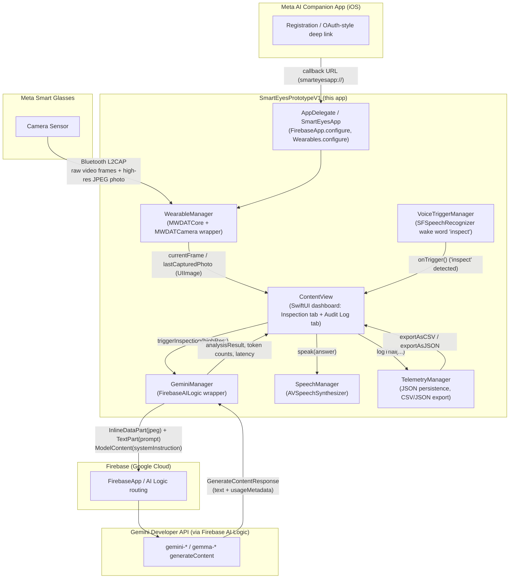

# Smart Eyes — Research/Testing-Track Prototype — Technical Documentation

*Chapter 4 supporting material: System Architecture and Technical Implementation*
*Thesis: "Smart Eyes — Building an AI visual assistant for real-world technical inspections"*

This document was generated by reading every Swift source file and project configuration file in this folder (`SmartEyesV1-research/`), as prepared for external handoff. Anything that could not be confirmed directly from the repository contents is marked `[VERIFY]`.

> **This is the base application.** This folder is the earlier research/testing-track prototype — a complete, independently replicable project — and this document is the authoritative technical reference for it. `../SmartEyesMVP` is a second, sibling application built by starting from this one and restructuring it into a use-case-driven client build; its own `DOCUMENTATION.md` is written as a delta against this document. If you are setting up either project for the first time, start here.

> **This is a sanitized handoff copy.** All developer-specific credentials (Meta `ClientToken`/`MetaAppID`, Apple Developer Team, Firebase config) have been removed or replaced with placeholders. See [`SETUP.md`](./SETUP.md) for exactly what to supply before this project will build. This is a meaningful difference from the internal working copy this documentation set was originally written against: the earlier internal copy had real values committed to `Info.plist`, which was flagged there as a security concern — that concern is now resolved in this handoff copy specifically because those values were replaced with placeholders.

---

## 1. Overview

This prototype (Xcode project `SmartEyesPrototypeV1`, bundle ID `ch.glisic.SmartEyesPrototypeV1`) is the **Test-Case / research-track application** for the thesis. Its purpose is narrow and deliberate: it validates the full pipeline **Meta Wearables Device Access Toolkit (DAT) → iOS capture/encode → Gemini vision-language model → structured inspection report → text-to-speech/telemetry**, end to end, on a real device (Meta smart glasses paired to an iPhone). It is not intended to be a polished product — its `ContentView` doubles as a live "Inspection" dashboard and an "Audit Log" screen (two tabs total; model selection and Gemini configuration live in a settings sheet reached from a header gear icon, not a separate tab) with CSV/JSON telemetry export, feedback buttons (thumbs up/down, 1–5 star rating), and a developer-facing simulator/mock mode so the UI can be exercised on the iOS Simulator without physical glasses.

The app implements three selectable **inspection modes** (Phase 1 "Baseline", Phase 2 "Industrial", Phase 3 "Stress Test") that swap the Gemini system instruction to test the model's behavior at increasing levels of visual difficulty (everyday objects → structured industrial inspection reporting → degraded/obstructed/motion-blurred imagery). Every trial (image, prompt, response, latency, token counts, human feedback) is logged locally for empirical analysis in the thesis.

**Relationship to `SmartEyesMVP`.** A sibling project, `../SmartEyesMVP`, builds directly on top of this application: it reuses the same DAT → Gemini pipeline validated here, replaces the three phase-bound inspection modes with four task-specific use cases, adds hands-free voice interaction via explicit tap-to-ask dictation (replacing this app's always-listening wake word), supports multi-turn follow-up questions about one photo, and adds bounded retry on transient model errors. Both applications reached the same endpoint on manual key handling: neither ships a working manual API-key-entry path (see Section 3 and Section 9) — this was true of the MVP from its Firebase migration onward, and is now also true of this application in the current handoff copy.

---

## 2. Prerequisites

**Hardware**
- A physical iPhone capable of running the configured deployment target (the iOS Simulator can run the app in a built-in **mock/simulation mode** that fabricates camera frames — see `WearableManager.swift` — but the DAT SDK's real Bluetooth/L2CAP camera streaming path only works on a physical device).
- Meta smart glasses supported by the Meta Wearables Device Access Toolkit (DAT), paired with the Meta AI companion app. `[VERIFY exact glasses model(s) used for testing]`.

**OS / Xcode / Swift**
- iOS deployment target: **26.5** (`IPHONEOS_DEPLOYMENT_TARGET = 26.5`, all build configurations in `SmartEyesPrototypeV1.xcodeproj/project.pbxproj`). `[VERIFY]` — this is an unusually high/future-looking deployment target; confirm it's intentional rather than a leftover from a pre-release Xcode SDK selection.
- Swift language version: **5.0** (`SWIFT_VERSION = 5.0`).
- Xcode version: `[VERIFY]` — not recorded in any project file.
- macOS host version: `[VERIFY]`.
- Code signing: `CODE_SIGN_STYLE = Automatic`; `DEVELOPMENT_TEAM` is blank in every build configuration in this handoff copy — you must select your own Apple Developer Team in Xcode's Signing & Capabilities tab before the project will build (see `SETUP.md`).

**Accounts / external services**
- **Apple Developer Program** account (Team ID), selected locally in Xcode — not pre-filled in this handoff copy.
- **Meta Wearables Developer Center** account — required to obtain a `MetaAppID` and `ClientToken` for the DAT SDK. `Info.plist` currently holds placeholder values (`YOUR_META_APP_ID`, `YOUR_META_CLIENT_TOKEN`) that must be replaced with your own registration's values.
- **Meta AI companion app** installed on the test iPhone, with **Developer Mode** enabled, to perform glasses registration and grant camera/microphone permissions via a deep-link callback.
- **Firebase project** (Google Cloud) with **AI Logic** (Gemini Developer API backend) enabled — the app authenticates to Gemini exclusively through Firebase, not a raw Google AI Studio key (see Section 4). No `GoogleService-Info.plist` is included in this handoff (it's gitignored); you supply your own.

**SDK / package versions** (from `Package.resolved`, see Section 3 for the full list): `firebase-ios-sdk` **12.15.0**, `meta-wearables-dat-ios` **0.7.0**, `generative-ai-swift` **0.5.6** (legacy/unused product, see Section 3).

---

## 3. Dependencies

All dependencies are Swift Package Manager packages, resolved in `SmartEyesPrototypeV1.xcodeproj/project.xcworkspace/xcshareddata/swiftpm/Package.resolved`.

| Package | Repository URL | Resolved version |
|---|---|---|
| Meta Wearables DAT SDK | `https://github.com/facebook/meta-wearables-dat-ios` | **0.7.0** |
| Firebase iOS SDK | `https://github.com/firebase/firebase-ios-sdk` | **12.15.0** |
| generative-ai-swift (legacy Gemini SDK) | `https://github.com/google/generative-ai-swift` | **0.5.6** |

Transitive Firebase dependencies pinned in `Package.resolved` (versions as locked): `abseil-cpp-binary` 1.2024072200.0, `app-check` 11.3.0, `GoogleAppMeasurement` 12.15.0, `google-ads-on-device-conversion-ios-sdk` 3.6.0, `GoogleDataTransport` 10.1.0, `GoogleUtilities` 8.1.1, `grpc-binary` 1.69.1, `gtm-session-fetcher` 5.3.0, `interop-ios-for-google-sdks` 101.0.0, `leveldb` 1.22.5, `nanopb` 2.30910.1, `promises` 2.4.1.

**Products actually linked into the app target** (from `project.pbxproj`):
- `FirebaseAI`, `FirebaseAILogic` — actively used (`GeminiManager.swift`, `FirebaseCore` in `SmartEyesApp.swift`).
- `MWDATCamera`, `MWDATCore` — DAT camera streaming/photo-capture and device registration/session core, used in `WearableManager.swift` and `SmartEyesApp.swift`.
- `MWDATDisplay`, `MWDATMockDevice`, `MWDATMockDeviceTestClient` — linked but **not imported/used** in any `.swift` file in this app target. Dead dependencies (present for future glasses-display features, or copied from a DAT sample project); the app implements its own hand-rolled mock mode in `WearableManager` (`isMockMode`, `generateMockFrame()`) rather than using the SDK-provided mock/test-client products.
- `GoogleGenerativeAI` — linked, but the legacy import (`import GoogleGenerativeAI`) is **not used anywhere** in this app's sources; `GeminiManager.swift` exclusively imports `FirebaseAILogic`.

**Note on the DAT SDK itself:** this handoff copy does not include a vendored/cloned checkout of `meta-wearables-dat-ios` (it's excluded via `.gitignore` — third-party code isn't redistributed as part of a client handoff). Add it via Xcode's *File → Add Package Dependencies* using the URL above; see `SETUP.md`.

### Meta Wearables DAT SDK (MWDATCore / MWDATCamera)

`WearableManager.swift` is the app's sole wrapper around the DAT SDK. It:

- Calls `Wearables.configure()` once at process start (in `SmartEyesApp.init()`), matching the SDK's documented singleton-configuration pattern, and *also* calls it a second time defensively inside `WearableManager.configureWearables()` when running outside the simulator — a small amount of redundancy the app tolerates rather than resolves.
- Uses the SDK's `AsyncSequence` idioms: `wearables.registrationStateStream()` and `wearables.devicesStream()` are consumed with `for await` loops to drive `@Published` SwiftUI state; `DeviceSession.stateStream()` is polled the same way to detect the transition into `.started`.
- Diverges from a minimal DAT integration in several deliberate, thesis-motivated ways:
  - **Device discovery has a manual timeout wrapper** (`waitForDiscoveredDevice(timeout:)`), polling every 0.5s for up to 10s, rather than relying purely on the SDK's async stream.
  - **A fixed 2-second sleep is inserted after camera-permission grant and before session creation** ("Allow Bluetooth L2CAP channel connection to stabilize after deep-link transition") — an empirically-found timing workaround.
  - **Stream configuration deliberately uses the lowest offered profile**: `StreamConfiguration(videoCodec: .raw, resolution: .low, frameRate: 2)` — 360×640 at 2 FPS, to minimize Bluetooth bandwidth so on-demand high-resolution photo captures don't trigger a device-side watchdog timeout.
  - **The app builds its own mock/simulation layer** (`isMockMode`, `generateMockFrame()`, a `Timer`-driven fake video feed drawn via Core Graphics) instead of using the SDK's own `MWDATMockDevice`/`MWDATMockDeviceTestClient` products, which are linked but unused. Mock mode auto-activates under `#if targetEnvironment(simulator)`.
  - **Session lifecycle self-healing**: `capturePhoto()` waits up to 6s for a high-res photo callback and, if the stream dropped as a side effect, automatically calls `startStream()` again to resume live video.
  - **High-resolution captures are persisted directly to the Photos library** (`UIImageWriteToSavedPhotosAlbum`) for manual quality inspection during data collection.
- Registration/unregistration (`startRegistration()`, `startUnregistration()`) and callback URL handling (`wearables.handleUrl(url)`, invoked from `SmartEyesApp`'s `.onOpenURL`) follow the DAT SDK's documented deep-link flow through the Meta AI companion app.

Reference: [github.com/facebook/meta-wearables-dat-ios](https://github.com/facebook/meta-wearables-dat-ios).

---

## 4. Configuration

### `Info.plist`

| Key | Purpose |
|---|---|
| `CFBundleURLTypes` / `CFBundleURLSchemes` | Registers the custom URL scheme **`smarteyesapp`**, the callback target when the Meta AI companion app redirects back into this app after glasses registration. |
| `MWDAT` (dict) | DAT SDK configuration block: `AppLinkURLScheme` = `smarteyesapp://`; `MetaAppID` and `ClientToken` — **placeholder values in this handoff copy** (`YOUR_META_APP_ID`, `YOUR_META_CLIENT_TOKEN`), to be replaced with your own Meta Wearables Developer Center registration; `TeamID` = `$(DEVELOPMENT_TEAM)` (resolved from Xcode build settings — currently blank in every build configuration, see `SETUP.md`); `DAMEnabled` = `true`. Unlike the MVP, this application's `MWDAT` block does **not** include an `Analytics.OptOut` key, so Meta's SDK-level analytics collection is on by default here (see Section 9). |
| `UISupportedExternalAccessoryProtocols` | `com.meta.ar.wearable` — the External Accessory protocol string the glasses advertise. |
| `UIBackgroundModes` | `bluetooth-central`, `bluetooth-peripheral`, `external-accessory`. |
| `LSApplicationQueriesSchemes` | `fb-viewapp`, `meta-view`. |
| `GEMINI_API_KEY` | A placeholder string (`"Your actual API key here"`) — dead configuration left over from before the Firebase migration; not read by any current code path (the manual key-entry UI that used to read a related `UserDefaults` value has been removed entirely — see Section 9). Harmless but could be deleted as further cleanup. |

No `.entitlements` file exists for the app target.

### `GoogleService-Info.plist`

Not present in this handoff copy (excluded via `.gitignore`, "Firebase credentials — never commit this"). You supply your own, downloaded from your Firebase project's iOS app registration — see `SETUP.md`.

### Environment variables / build-time secrets

The **only** live path for reaching Gemini is `FirebaseAI.firebaseAI(backend: .googleAI())` inside `GeminiManager.swift`; per Firebase AI Logic's design, the actual Gemini API key is held server-side by Firebase and never appears in app code or `Info.plist`.

### Security note

This handoff copy has already resolved the credential-exposure issue noted in earlier internal documentation of this project: the `MetaAppID` and `ClientToken` in `Info.plist` are now placeholder strings, not real values, and `DEVELOPMENT_TEAM` is blank. Nothing sensitive is committed in this copy as it stands. The residual, structural point worth keeping in mind for future work: the DAT SDK's configuration model requires `MetaAppID`/`ClientToken` to live in `Info.plist` (they cannot be moved to a `GoogleService-Info.plist`-style downloaded file the way the Firebase key is), so whoever fills in real values before building should be mindful not to commit them back into version control.

---

## 5. Architecture & data flow



```mermaid
sequenceDiagram
    actor User
    participant CV as ContentView
    participant WM as WearableManager
    participant Glasses as Meta Glasses (DAT stream)
    participant GM as GeminiManager
    participant FB as Firebase AI Logic
    participant Gem as Gemini model
    participant TM as TelemetryManager
    participant SM as SpeechManager

    User->>CV: Tap "ANALYSE CURRENT FRAME" (or say "inspect")
    CV->>CV: selectedTab = Audit Log; isAnalyzing = true
    alt high-res capture
        CV->>WM: capturePhoto()
        WM->>Glasses: stream.capturePhoto(format: .jpeg)
        Glasses-->>WM: photoDataPublisher event (JPEG bytes)
        WM-->>CV: UIImage
    else low-res (stream frame)
        CV->>CV: use wearableManager.currentFrame (360x640 @ 2 FPS)
    end
    CV->>GM: analyzeFrame(image, mode, customPrompt)
    GM->>GM: compressImageForAPI() -> resize to max 1920px, JPEG q=0.95
    GM->>GM: select systemInstruction for InspectionMode (phase1/2/3)
    GM->>FB: FirebaseAI.firebaseAI(backend: .googleAI()).generativeModel(...)
    GM->>FB: generateContent([InlineDataPart(jpeg), TextPart(prompt)])
    FB->>Gem: forward multimodal request
    Gem-->>FB: response.text + usageMetadata
    FB-->>GM: GenerateContentResponse
    GM-->>CV: responseText, lastResponseTime
    CV->>TM: logTrial(phase, source, captureMode, imageSize, latency, prompt, response, severity, aiModel, token fields)
    CV->>SM: speak(answer) [if isVoiceEnabled]
    CV-->>User: render chat bubble + compliance badge + latency/token footer
```

**Prose.** The app has no server component: all orchestration happens on-device inside the `WearableManager` → `GeminiManager` → `TelemetryManager`/`SpeechManager` chain, driven by SwiftUI `@Published` state observed by `ContentView`. Camera frames arrive from the glasses over Bluetooth L2CAP as either a continuous low-bandwidth raw video stream or an on-demand high-resolution JPEG photo capture; both paths converge on a `UIImage` that `GeminiManager.compressImageForAPI` re-encodes as JPEG before wrapping it in an `InlineDataPart`. The response's `usageMetadata` is decomposed into text/image/thinking/output token buckets and persisted per-trial by `TelemetryManager`. `VoiceTriggerManager` listens for the spoken word "inspect" to fire the same analysis path hands-free — this app no longer ships a second, unused wake-word implementation alongside it (see Section 9).

---

## 6. File-by-file reference

### `SmartEyesPrototypeV1/` (app target sources)

- **`SmartEyesApp.swift`** — App entry point. `AppDelegate.application(_:didFinishLaunchingWithOptions:)` calls `FirebaseApp.configure()`; `App.init()` calls `Wearables.configure()` once at startup; `.onOpenURL` forwards the Meta AI companion app's callback URL to `WearableManager.shared.handleCallbackURL(url)`.
- **`ContentView.swift`** — The UI layer, including a nested settings sheet (retitled **"Configure Gemini Model"** in this revision — see Section 9). Key types: `MessageItem` (chat bubble model, links to a `TrialRecord` via `trialId`), `ContentView` (root `TabView` with "Inspection" and "Audit Log" tabs). Key functions: `triggerInspection(highRes:)` (capture → Gemini → telemetry → speech), `captureOnlyPhoto()` (bypasses Gemini, just captures/saves a high-res photo), `complianceBadge(for:)`/`feedbackRow(for:)` (keyword-based severity badge and thumbs-up/down + 5-star feedback UI), `exportCSV()`/`exportJSON()`/`shareFile(url:)`. Gotcha: severity classification is a naive `String.lowercased().contains("critical"/"warning"/"nominal")` scan over the raw model response text, not a structured field.
- **`WearableManager.swift`** — Singleton wrapper around `MWDATCore`/`MWDATCamera`. See Section 3 for detailed behavior.
- **`GeminiManager.swift`** — Singleton wrapper around Firebase AI Logic. See Section 7. Key type: `InspectionMode` enum (`.phase1`/`.phase2`/`.phase3`). Default model: `gemini-3.5-flash`, persisted via `UserDefaults` key `GEMINI_MODEL_NAME`. Gotcha: `hasAPIKey` checks `FirebaseApp.app() != nil`, not the presence of any API key — when Firebase isn't configured, the function falls back to a local `generateMockResponse(for:)` simulator.
- **`SpeechManager.swift`** — Singleton TTS wrapper (`AVSpeechSynthesizer`). Strips markdown punctuation before synthesizing; `AVAudioSession` category `.playback`/mode `.voicePrompt` with `.allowBluetoothA2DP`/`.duckOthers`.
- **`VoiceTriggerManager.swift`** — Singleton, **actively used** hands-free trigger. Uses `SFSpeechRecognizer`/`AVAudioEngine` to continuously transcribe microphone input and scan for the wake word **`"inspect"`**, with a 4-second cooldown and auto-restart-on-error logic. On detection, calls the `onTrigger` closure supplied by `ContentView`.
- **`TelemetryManager.swift`** — Singleton local persistence/export layer. `TrialRecord` (`Codable`, `Identifiable`): timestamp, phase, source, capture mode, image dimensions, latency, prompt, raw response, parsed severity, model, per-modality token counts, and mutable human-feedback fields. Persists to `Documents/telemetry_records.json`. `exportAsCSV()` writes a semicolon-pair (`;;`) delimited CSV with a placeholder `test_case` column literally containing `"Please enter test case"`.

### `SmartEyesPrototypeV1.xcodeproj/`

Single-target Xcode project, `PBXFileSystemSynchronizedRootGroup` (folder-based source sync), one Debug and one Release configuration, `CODE_SIGN_STYLE = Automatic`, `DEVELOPMENT_TEAM` blank in this handoff copy, `SWIFT_VERSION = 5.0`, `IPHONEOS_DEPLOYMENT_TARGET = 26.5`, `MARKETING_VERSION = 1.0`.

### Root-level files

- **`Info.plist`** — app target Info.plist (Section 4).
- **`README.md`** — client-facing quick reference: what the app does, project structure, how the DAT and Gemini integrations work, how to test/run. Complements this document rather than duplicating it.
- **`SETUP.md`** — the credential-setup checklist for this handoff copy (Firebase, Meta Developer Center, Apple code signing).

---

## 7. CV API integration & prompt design

**Model(s).** The active model is selected at runtime via `GeminiManager.selectedModel`, defaulting to **`gemini-3.5-flash`**. The settings sheet's model picker exposes: `gemini-3.5-flash`, `gemini-3.1-flash-lite`, `gemini-3-flash`, `gemini-2.5-flash`, `gemini-2.5-flash-lite`, `gemma-4-26b-a4b-it`, `gemma-4-31b-it`. `[VERIFY]` whether these are the actual model IDs available at the time of thesis submission.

**Backend.** All live calls go through **Firebase AI Logic** with the **Gemini Developer API backend** (`FirebaseAI.firebaseAI(backend: .googleAI())`), not the legacy `generative-ai-swift`/`GoogleGenerativeAI` SDK (linked but unused).

**Image encoding.** `GeminiManager.compressImageForAPI(image:)` downsizes any input whose longest edge exceeds 1920px, re-encodes as JPEG at `compressionQuality: 0.95`, and sends it as an `InlineDataPart(data:mimeType: "image/jpeg")` paired with a `TextPart(prompt)`.

**System instruction / prompt structure.** Selected per `InspectionMode`:
- **Phase 1 (Baseline)** — fast, objective visual assistant; extreme brevity (1–2 sentences), everyday-object/basic-safety/schematic recognition, lighting-degradation notes.
- **Phase 2 (Industrial)** — persona "Smart Eyes", a specialized industrial inspection assistant; precise analog-dial reading estimation, valve open/closed state detection, LED status reporting, bolt/component completeness counting, and a fixed structured report template: `OBJECT DETECTED` / `STATE/VALUE` / `DETECTED ANOMALY` / `SEVERITY` (Critical/Warning/Nominal) / `SUGGESTED ACTION`. **Note:** the live system instruction string in `GeminiManager.swift` contains exactly one introductory sentence for this phase ("You are 'Smart Eyes', a specialized industrial inspection assistant. Your goal is to perform high-precision inspection of machinery, piping, gauges, valves, and structural integrity.") — if any other document reproduces two similar-but-different introductory sentences back to back for Phase 2, that no longer matches this source file and should be corrected to the single sentence above.
- **Phase 3 (Stress Test)** — "robust visual stress-test analyst"; perspective de-warping, low-contrast/glare filtering, contextual inference around 30–50% obstruction, rust/corrosion/pitting severity classification, explicit uncertainty reporting.

**No literal "SUVA" text appears in `GeminiManager.swift`'s system instructions.** The severity/action reporting structure in Phase 2 is modeled on that kind of compliance-audit framing, but the specific string "SUVA" is not present in the prompt text itself. The MVP's Workplace Safety use case is the first prompt in either application to name SUVA explicitly.

**User prompt.** If the operator leaves the optional text field empty, a mode-specific default prompt is sent; otherwise free-text input is sent verbatim.

**Response parsing.** `response.text` is used as-is. No JSON-schema-constrained output. Severity derivation is a case-insensitive substring search for `"critical"`, `"warning"`, `"nominal"`/`"satisfactory"` in the raw response text.

**Token & latency handling.** `analyzeFrame` records wall-clock latency around the request. Token accounting from `response.usageMetadata`: `promptTokenCount` → `lastInputTokens`, `candidatesTokenCount` → `lastOutputTokens`, `totalTokenCount` → `lastTotalTokens`, `thoughtsTokenCount` → `lastThinkingTokens`, with `promptTokensDetails` split into `TEXT`/`IMAGE` modality counts.

**Error handling.** `GenerateContentError` cases are pattern-matched (`.internalError`, `.promptImageContentError`, `.promptBlocked`, `.responseStoppedEarly`), with a required `default:` case since Firebase AI Logic uses structs rather than a closed enum for some error types. **This application does not implement request retry** — a failed call is surfaced to the technician immediately (contrast with the MVP, which adds bounded retry for transient 500/503 responses — see the MVP's `DOCUMENTATION.md`).

---

## 8. Build, run & test

1. **Supply your own credentials first** — follow [`SETUP.md`](./SETUP.md) in full: create/select a Firebase project with AI Logic enabled, register an iOS app and add its `GoogleService-Info.plist`, register your own app with the Meta Wearables Developer Center and replace the `YOUR_META_APP_ID`/`YOUR_META_CLIENT_TOKEN` placeholders in `Info.plist`, add the `meta-wearables-dat-ios` package dependency, and select your own Apple Developer Team in Xcode.
2. **Open `SmartEyesPrototypeV1.xcodeproj` in Xcode.** The `firebase-ios-sdk` and `generative-ai-swift` package requirements should resolve automatically from `Package.resolved`; add `meta-wearables-dat-ios` manually as it isn't pre-declared as a resolvable dependency in this handoff copy without the vendored checkout (see `SETUP.md`).
3. **Build and run on a physical iPhone** running iOS 26.5 or later for real DAT streaming; the Simulator auto-enables the app's built-in mock-frame mode (no glasses needed to exercise the UI/Gemini path with fabricated imagery).
4. **Glasses pairing / Developer Mode registration**: power on the glasses, pair with the Meta AI companion app, enable Developer Mode in that app's settings.
5. **In the app**, tap the connection control to register (deep-links to the Meta AI app for Camera/Microphone permission grants, then redirects back via the `smarteyesapp://` callback URL).
6. **Start the feed**, select an Inspection Mode (Phase 1/2/3), optionally type a custom question, and tap the analyse action or say **"inspect"** aloud to trigger analysis.
7. **Review results** in the Audit Log tab; use the settings sheet (gear icon) to change the target Gemini model. Export telemetry as CSV.

There is **no automated test target** in the Xcode project — all "testing" is manual/empirical, consistent with this app's role as a research/testing-track instrumentation harness.

---

## 9. Known limitations / migration notes

This section reflects the state of the code as prepared for external handoff, and supersedes the equivalent section in any earlier internal documentation of this project.

- **Manual API-key entry has been removed, not just deprecated.** Earlier internal documentation of this project noted that the settings sheet still contained a working (if unrecommended) manual Gemini-API-key entry field left over from before the Firebase migration. In the current code, that field, its backing `@State private var apiKeyInput`, and the `UserDefaults.standard.set(...) forKey: "GEMINI_API_KEY"` write have all been deleted. The sheet is retitled **"Configure Gemini Model"** and is now purely a model picker, with copy explaining that the API key is managed via Firebase. The `GEMINI_API_KEY` placeholder string still sitting in `Info.plist` (Section 4) is now fully inert — nothing reads it.
- **This app no longer carries a second, unused wake-word implementation alongside its active one.** Earlier internal documentation noted a `VoiceManager.swift` file present in source but never referenced from `ContentView` — a "Hey Gaze"/"Gaze" wake-word implementation kept only as a reference module. That file has been removed from this handoff copy; only `VoiceTriggerManager.swift` (the active "inspect" wake-word trigger) remains.
- **`generative-ai-swift`/`GoogleGenerativeAI` and `MWDATDisplay`/`MWDATMockDevice`/`MWDATMockDeviceTestClient` remain linked to the app target but are unused** by any app source file — dead dependencies that inflate build time/binary size.
- **SUVA regulations are referenced in the accompanying `README.md` but not literally present in the live system-instruction text** in `GeminiManager.swift` (see Section 7).
- **Severity/compliance classification is purely lexical**, not a structured, schema-validated field.
- **Bluetooth/session-timing workarounds are magic-number based** (a 2-second post-permission-grant sleep, a fixed 6-second high-res-photo timeout) rather than driven by explicit SDK-reported readiness signals.
- **No automated tests** exist in the Xcode project.
- **Export UX gap**: `TelemetryManager.exportAsJSON()` exists and is fully implemented, but no button in the Audit Log currently calls it — only CSV export is wired into the UI.
- **CSV test-case column is a manual-entry placeholder** (`"Please enter test case"` literal string in every exported row).
- **This app does not opt out of Meta's SDK-level analytics collection** (no `MWDAT.Analytics.OptOut` key in `Info.plist`, unlike the MVP — see Section 4). If this matters for the thesis's data-handling posture, add the key explicitly.
